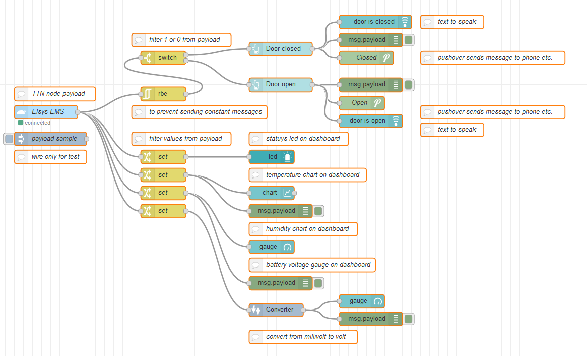

# Elsys-EMS-TTN-node-RED
Elsys indoor LoRaWan wireless sensor with TTN and node-RED

Recently I got my hands on this nice small indoor LoRaWan sensor whit different features like Temperature, Humidity, Leak detection, Magnetic switch Acceleration, NFC and a battery life time of approx. 10years. I registered this device in  the TTN Console and created an application with node-RED that reads the temperature, humidity, battery voltage and reedrelay status.

<b>What's inside?</b>

You can open the case with the help of a small screwdriver, slit between the bottom and the upper part.
Here are some pictures from the inside.

<b>Elsys EMS parts</b>

<b>Elsys EMS frontside</b>

<b>Elsys EMS teardown</b>

<b>Elsys EMS backsider</b>

<b>Leak detection contact</b>

This sensor is equipped with NFC (Near Field Communication) for easy configuration with an Android phone. With the application "Sensor Settings" you can create your own configuration settings and upload them to the Elsys EMS sensor using this NFC feature.

The very comprehensive, clear site contains all the information needed to bring this sensor online. You can find there: Datasheets, Usermanuals, Firmware versions, documentation about the Android App, battery life calculator, Downlink generator, NFC coding, Javascript payload decoder, TTN payload decoder ... in short super extensive site. Fine!! https://www.elsys.se/en/lora-ems/

<b>Steps to take:</b>

1. Install "Sensor Settings" Android app on your smartphone.

2. Switch on NFC on your smartphone

3. Create a new Application + new Device in TTNconsole. Device ID can be found in android app under sensor settings.

4. For OTAA join, App EUI and AppKey copy from ttnconsole to phone (I have converted notation from upper case and spaces in TTN to lower case, no spaces in Android app).

5. In Android app:
Configure all components and open the switches for the custom items, example:
Sensor: EMS
Timebase: 30 Sec (gets warning but good to test)
Temp / hum / Light ..periods etc .: 1
Sensor leys: OTAA
Advanced: Datarate> DR5, Datarate max> DR5, Datarate min> 0
Port: 1
...etc.

6. In Android App, click Write and tap the phone against the bottom of the sensor

7. Configuration is transferred via NFC.

<b>node-RED flow</b>

I created an application in node-RED with a dashboard:

<b>For testing wire to the inject node</b>

<b>The flow, with dashboard, pushover, status led and text to speak nodes</b>

The node-RED dashboard</b>

</p

  
